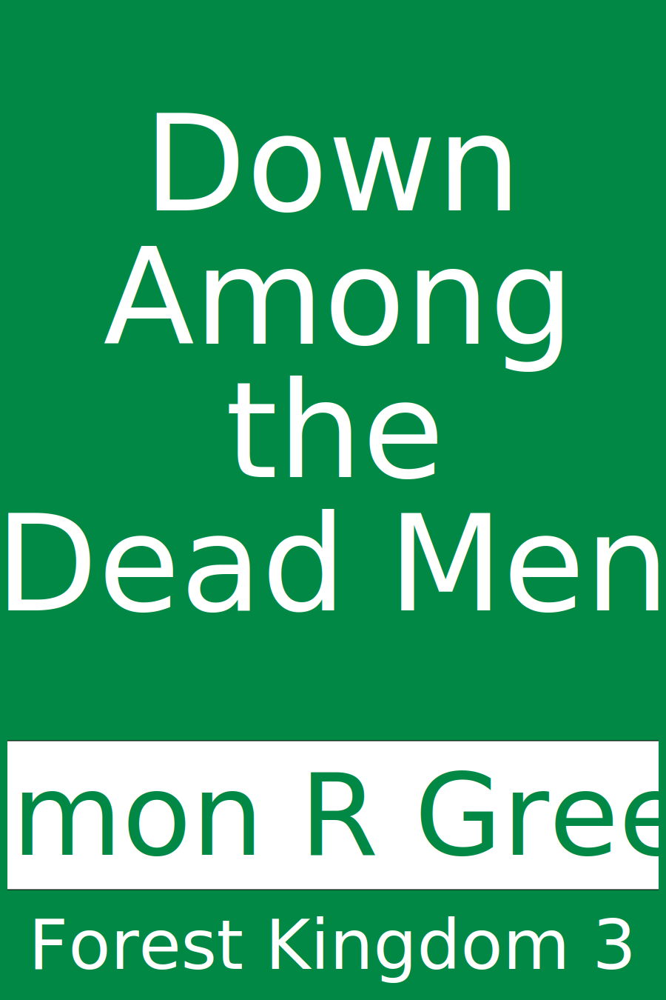

# Create Cover

Generate a 900 x 1350 pixel SVG cover.
Supports a small selection of themes using a standard (and auto-arranging) layout.

*(Examples are at the bottom.)*

## To generate a cover

Currently *some* details are hard-coded, though the logic is in there to support the
required options once arguments have been passed through.

Example command:

```sh
dotnet run -- -titlefontsize=190 -file=cover.svg -title="Down\nAmong\nthe\nDead Men" -author="Simon R Green" -series="Forest Kingdom 3" -theme=default
```

## To convert to a PNG

- Open the SVG file in a Chromium browser (eg Brave)
- Right-click on it and choose 'Inspect'
- In the 'Elements' right-click on the SVG node
- Choose 'Capture node screenshot' to save it as a PNG

## Examples

### SVG



### PNG


