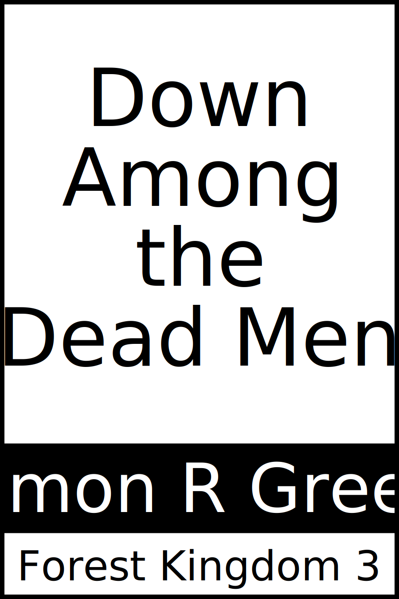

# Create Cover

Generate a 900 x 1350 pixel SVG book cover.
Supports a small selection of themes using a standard (and auto-arranging) layout.

*(Examples are at the bottom.)*

## Contents

- [Pre-built binaries](#pre-built-binaries)
    - [Run from anywhere](#run-from-anywhere)
- [To generate a cover](#to-generate-a-cover)
    - [Supported options](#supported-options)
    - [Exclamation marks](#exclamation-marks)
- [To convert to a PNG](#to-convert-to-a-png)
- [Examples](#examples)
- [Generating new builds](#generating-new-builds)

## Pre-built binaries

There are [stand-alone executables for Linux, Mac, and Windows](./builds).
They *do not* require dotnet to be installed and are runnable from anywhere your OS allows.

### Run from anywhere

As builds are pretty small you can include ones for relevant platforms directly into your own book project tooling/repositories. Alternatively, you can copy a build to somewhere accessible via your system path so you can run it from anywhere. Here's an example on a Mac:
If you need new builds see the [generating new builds](#generating-new-builds) section.

```sh
cd <solution>
sudo rm -rf /usr/local/bin/CreateCover
sudo cp builds/macos-arm64/CreateCover /usr/local/bin/CreateCover
```

On Linux the commands should be similar though the binary copied will obviously not be the Mac one.

On Windows place it anywhere convenient. Use your *Control Panel*'s *Environment Variables* options to either find a place in your `PATH` to place it or to add a new location to that `PATH`.

## To generate a cover

Example commands for when running directly from source (with dotnet 7+ installed):

```sh
cd <project>
dotnet run -- -title "Down|Among|the|Dead Men" -author "Simon R Green" -series "Forest Kingdom 3" -theme "blue"
```

If you've added it to your path it's simpler (no dotnet installation required):

```sh
cd <wherever>
CreateCover -title "Down|Among|the|Dead Men" -author "Simon R Green" -series "Forest Kingdom 3" -theme "blue"
```

### Supported options

Running `CreateCover` displays the following:

```
CREATE COVER
Generate a 900x1350 pixel SVG book cover

OPTIONS

  -author          text     * the book author (eg "JRR Tolkien")  
  -file            text     * where to write the output  [cover.svg]
  -series          text     * the book series (eg "The Lord of the Rings 1")  
  -title           text     * the book title (eg "The | Fellowship | of the | Ring")  
  -authorfont      text       author font names  [Tahoma,Arial]
  -authorfontsize  integer    size of author font in pixels  [90]
  -seriesfont      text       series font names  [Tahoma,Arial]
  -seriesfontsize  integer    size of series font in pixels  [90]
  -theme           text       the colour theme  [default]
  -titlefont       text       title font names  [Impact,Tahoma,Arial]
  -titlefontsize   integer    size of title font in pixels  [180]

  * means required, values in square brackets are defaults

THEMES

  default, dark, blue, green, red, yellow, orange
```

The `title`, `author`, and `series` all support including either a pipe symbol (`|`) or `\n` as a line break.  In the example above of `The \n Hobbit` (which could also be written as `The | Hobbit`) when the title is added to the cover the text will wrap onto a new line where the `\n` or `|` appears (extra spacing around them is ignored).
In combination with the `titlefontsize` this allows adjusting the size and layout of the title for the best use of the space allocated on the cover image.

### Exclamation marks

 On Linux or Mac, depending upon your configuration, the terminal prompt is likely to interpret the exclamation mark 'unhelpfully' when enclosed within double-quotes. For example a book title of `"Toro!"` is likely to not run as expected. *This is a system thing, not a Create Cover issue*.

If it happens, replace the double quotes with single quotes and it should work (eg `'Toro!'`).
The reason the examples use double quotes is that otherwise if your title includes an apostrophe it will be seen as closing the single quotes early given that it is the same character.

Another option which often works is to use the double quotes but with an *escaped* exclamation mark, for example `"Toro\!"` where the `\` before the `!` stops it being treated as a special character. Not all systems support this; the latest Mac (which runs *zsh*) does.

## To convert to a PNG

- Open the SVG file in a Chromium browser (eg Brave)
- Right-click on it and choose 'Inspect'
- In the 'Elements' right-click on the SVG node
- Choose 'Capture node screenshot' to save it as a PNG

## Examples

### `-theme=default`


### `-theme=blue`


### `-theme=green`


## Generating new builds

There are scripts available which will work on Linux, Mac, and Windows.
Run the one *for your platform* and it will produce new builds for all three.

### Linux and Mac

```sh
cd <solution>/CreateCover
./build.sh
```

### Windows

```bat
cd <solution>\CreateCover
build.bat
```
