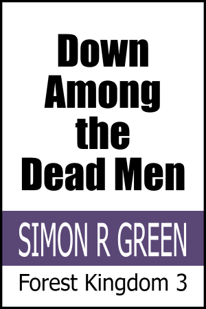
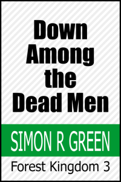

# Create Cover

Generate themed 900x1350 pixel book covers (SVG and PNG).
Supports 4 themes x 20 colours using a standard (and auto-arranging) layout.

Includes optional *transparent backgrounds* - generate a cover PNG with transparency and lay it on top of another image or photo to let that image show through.

Licensed under the [AGPL](./LICENSE.txt).



*(More examples further down.)*

## Contents

- [Pre-built binaries](#pre-built-binaries)
    - [Run from anywhere](#run-from-anywhere)
- [To generate a cover](#to-generate-a-cover)
    - [Supported options](#supported-options)
    - [Exclamation marks](#exclamation-marks)
- [To convert to a PNG](#to-convert-to-a-png)
- [Examples](#examples)
- [Generating new builds](#generating-new-builds)

## Pre-built binaries

There are [stand-alone executables for Linux, Mac, and Windows](./builds).
They *do not* require dotnet to be installed and are runnable from anywhere your OS allows.

### Run from anywhere

As builds are pretty small you can include ones for relevant platforms directly into your own book project tooling/repositories. Alternatively, you can copy a build to somewhere accessible via your system path so you can run it from anywhere. Here's an example on a Mac:
If you need new builds see the [generating new builds](#generating-new-builds) section.

```sh
cd <project>
sudo rm -rf /usr/local/bin/CreateCover
sudo cp ../builds/macos-arm64/CreateCover /usr/local/bin/CreateCover
CreateCover
```

On Linux the commands should be similar though the binary copied will obviously not be the Mac one.

On Windows put it anywhere convenient. Use your *Control Panel*'s *Environment Variables* options to either find somewhere in your `PATH` to place it or to add a new location to that `PATH`. For example if you have `C:\Apps` in your `PATH` you could use:

```bat
cd <project>
copy ..\builds\win10-x64\CreateCover.exe C:\Apps\CreateCover.exe
CreateCover
```

## To generate a cover

Example commands for when running directly from source (with dotnet 7+ installed):

```sh
cd <project>
dotnet run -- -author "SIMON R GREEN" -file "../example-covers.html" -series "Hawk & Fisher 1-3" -subtitlefont "Tahoma,90" -subtitle "Hawk and Fisher|Winner Takes All|The God Killer" -title "Swords|of|Haven" -scaleauthor -scaleseries
dotnet run -- -author "SIMON R GREEN" -file "../example-covers.html" -series "Hawk & Fisher 4-6" -subtitlefont "Tahoma,70" -subtitle "Wolf in the Fold|Guard Against Dishonor|The Bones of Haven" -title "Guards|of|Haven" -scaleauthor -scaleseries
dotnet run -- -file "..\example-covers.html" -title "Down|Among|the|Dead Men" -author "SIMON R GREEN" -series "Forest Kingdom 3" -authorfont "Tahoma,200" -scaleauthor -scaleseries
```

If you've added it to your path it's simpler (no dotnet installation required):

```sh
cd <wherever>
CreateCover -author "SIMON R GREEN" -file "../example-covers.html" -series "Hawk & Fisher 1-3" -subtitlefont "Tahoma,90" -subtitle "Hawk and Fisher|Winner Takes All|The God Killer" -title "Swords|of|Haven" -scaleauthor -scaleseries
CreateCover -author "SIMON R GREEN" -file "../example-covers.html" -series "Hawk & Fisher 4-6" -subtitlefont "Tahoma,70" -subtitle "Wolf in the Fold|Guard Against Dishonor|The Bones of Haven" -title "Guards|of|Haven" -scaleauthor -scaleseries
CreateCover -file "..\example-covers.html" -title "Down|Among|the|Dead Men" -author "SIMON R GREEN" -series "Forest Kingdom 3" -authorfont "Tahoma,200" -scaleauthor -scaleseries
```

### Supported options

Running `CreateCover` displays the following:

```
CREATE COVER
Generate themed 900x1350 pixel PNG and SVG book covers

OPTIONS

  -file          text  * where to write the output  [covers.html]
  -title         text  * the book title (eg "The | Fellowship | of the | Ring")
  -subtitle      text    the book subtitle (eg titles in a box set)
  -author        text  * the book author (eg "JRR Tolkien")
  -series        text  * the book series (eg "The Lord of the Rings 1")
  -titlefont     text    title font name,pixels  [Impact,180]
  -subtitlefont  text    subtitle font,pixels  [Tahoma,75]
  -authorfont    text    author font,pixels  [Tahoma,110]
  -seriesfont    text    series font,pixels  [Tahoma,100]
  -transparent           the cover has no background colour
  -scaleauthor           scale author name to fit its area
  -scaleseries           scale series name to fit its area
  -debug                 show extra debugging info

  * is required, values in square brackets are defaults
```

The output will be a HTML page (named as per `-file`) with a thumbnail-size scaleable SVG cover for each theme.
Clicking on any of those covers will reveal a 900x1350 PNG version ready for copying/saving.

The `title`, `author`, and `series` all support including either a pipe symbol (`|`) or `\n` as a line break.  In the example above of `The | Fellowship | of the | Ring` (which could also be written as `The \n Fellowship \n of the \n Ring`) when the title is added to the cover the text will wrap onto a new line where the `\n` or `|` appears (extra spacing around them is ignored).
In combination with the `titlefontsize` this allows adjusting the size and layout of the title for the best use of the space allocated on the cover image.

The `-scaleauthor` and `-scaleseries` options write the author and/or series using their font size, but scale the text and its spacing evenly to fit the width of that area of the cover.
Note that the vertical sizing of the text is *not* affected, so you may still need to tweak the original font size if the scaling affects the width of the letters adversely.

The *subtitle* options relate to smaller text that can appear below the title.
Usually this is not necessary but it could be used for example in cases like *The Hobbit* where the subtitle could be *There and Back Again*.
It might also be used to list individual book names where the title is for an omnibus edition or collection. Realistically, three at the most due to space constraints.

Selecting `transparent` will still render the themed thumbnails with background colours, but when they are clicked the full size image at the base will be transparent.  Many themes will look the same when drawn large; this is correct as the background colour was their only differentiation.  Nevertheless, even with transparency it's worth generating the larger version by clicking the theme with the *expected* final colour, as the anti-aliasing inherent in the lettering on the PNG will be more accurate.

*Technical note:* using your browser's `inspect` option on a thumbnail's SVG element will usually allow you to export that node for use elsewhere (eg save to a file and open in Inkscape).  Despite the thumbnail appearance, the SVG correctly excludes the background if transparency was requested.

The `debug` option adds bounding boxes drawn around the text areas in the covers (to help you fine-tune font sizes etc if required).

### Exclamation marks

 On Linux or Mac, depending upon your configuration, the terminal prompt is likely to interpret the exclamation mark 'unhelpfully' when enclosed within double-quotes. For example a book title of `"Toro!"` is likely to not run as expected. *This is a system thing, not a Create Cover issue*.

If it happens, replace the double quotes with single quotes and it should work (eg `'Toro!'`).
The reason the examples use double quotes is that otherwise if your title includes an apostrophe it will be seen as closing the single quotes early given that it is the same character.

Another option which often works is to use the double quotes but with an *escaped* exclamation mark, for example `"Toro\!"` where the `\` before the `!` stops it being treated as a special character. Not all systems support this; the latest Mac (which runs *zsh*) does.

## Examples

Here are some sample outputs.
All were originally produced at 900x1350 but have been scaled down to 200x300 for use here.
The second one was produced in `-debug` mode which adds boundary boxes for the text (and restricts the colours to help with the box visibility), and the third was drawn using `-transparent` (shown here with a striped background replacing the transparent areas for clarity and for consistency across browsers).

   
   

## Generating new builds

There are scripts available which will work on Linux, Mac, and Windows.
Run the one *for your platform* and it will produce new builds for all three.

### Linux and Mac

```sh
cd <solution>/CreateCover
./build.sh
```

### Windows

```bat
cd <solution>\CreateCover
build.bat
```

### The example outputs

These should be recreated whenever code changes will affect the output.
You can use the sample commands shown previously.

Right-click the PNG on the covers page and save over the top of the example images in the repo root, then open each in an image editor/previewer and proportionally scale to 200x300.
